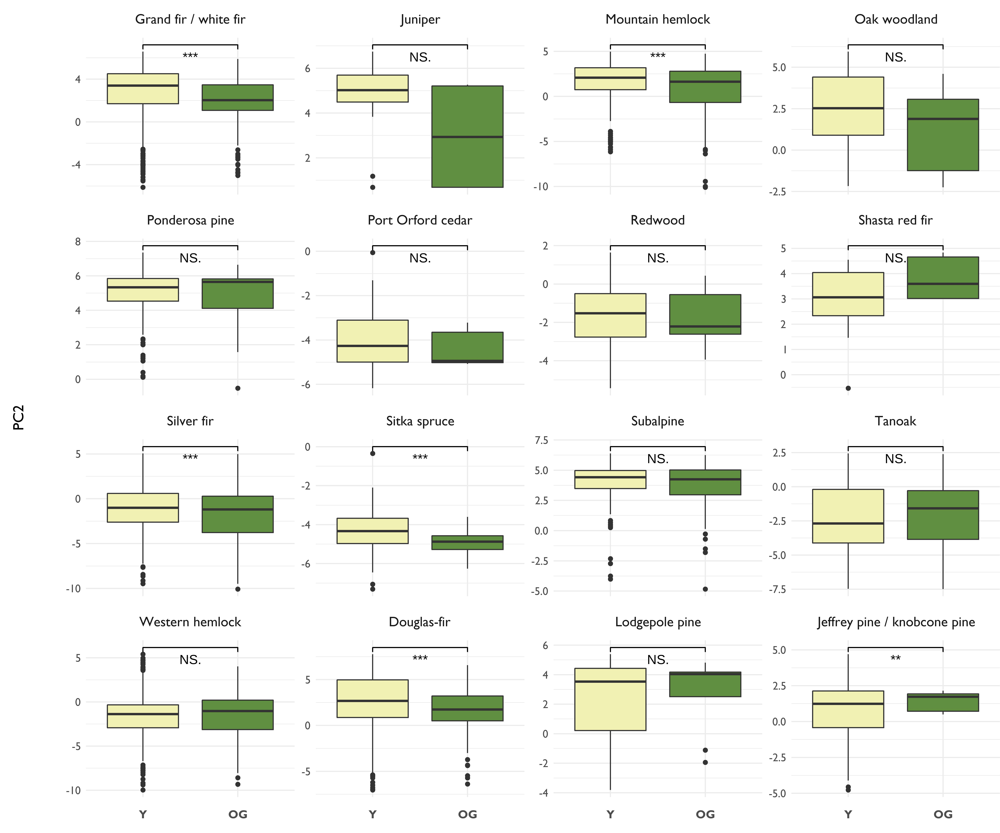

## Abstract

Recruiting, restoring, and retaining old-growth forests throughout the country has been proposed as a climate change adaptation strategy and efforts to develop national forest management policies consistent with these goals are ongoing. While much of the initial science support has been geared towards developing methods to classify and inventory mature and old-growth forests, understanding the current distribution of older forests across climate gradients remains a key knowledge gap. Here, we evaluated current and projected multivariate climate gradients across stages of forest structural development and among the major forest vegetation zones found in the Pacific Northwest. Gridded climate data representing annual and seasonal patterns were reduced via principal components analysis into their first three major axes representing temperature, precipitation, and humidity/water deficit. These scores were extracted at forest plots managed by the Forest Inventory and Analysis (FIA) program. Each FIA plot was also attributed with an old-growth structural index (OGSI) intended to represent the continuous nature of forest structural development in terms of the density of large live trees, diversity of live tree size classes, density of large snags, and cover of downed woody material. The OGSI values were used to classify FIA plots into “young”, “mature”, and “old-growth” stages consistent with protocols developed to monitor older forests across the study area. We tested for differences in the current and future climate spaces occupied by these structural stages across major forest vegetation zones. We found old-growth to currently be distributed along significantly colder gradients relative to young forests for two wide-ranging, lower elevation forest type-groups (i.e., western hemlock, Sitka spruce). Old-growth in the Douglas-fir, Pacific silver sir, and grand fir/white fir vegetation zones are currently found in warmer locations relative to younger forests. We also observed old-growth occupying relatively wetter climate spaces for many forest vegetation zones that span elevation gradients (i.e., Douglas-fir, Sitka spruce, Pacific silver sir, mountain hemlock, and grand fir/white fir). Climate dissimilarity - a measure of departure between current and future multivariate climate space - was significantly higher at old-growth western hemlock and lodgepole pine plots relative to younger forest, while climate dissimilarity was significantly lower in other old-growth vegetation zones relative to younger forest. Our findings suggest the distribution of forest structural stages is not spatially distributed evenly across climatic domains for some forest vegetation zones in the Pacific Northwest. In addition, younger forests may be exposed to the effects of a changing climate to a greater extent than current old-growth forest. Recruiting future old-growth stands should consider diversifying these efforts across climatic domains as part of a broader climate change adaptation strategy.


## Methods

Stages of forest structural development are derived from plot-level data collected by the US Forest Service Forest Inventory and Analysis (FIA) program. FIA plots are spatially distributed across forested areas the US, regardless of ownership patterns, and serve as strategic level information for many national forest planning efforts. Metrics that describe the continuous nature of forest development have been developed for each of these forest vegetation zones as part of a multi-decadal effort to monitor the trends and status of older forests throughout the study area. This old-growth structural index (OGSI) makes use of information on the density of large live trees, diversity of live tree size classes, density of snags, and cover of downed woody material to assign a score to each FIA plot. Different formulations of the OGSI occur in each of the 16 forest vegetation zones to account for broad differences in old-growth character. For example, only the density of large live trees factor into the OGSI in the ponderosa pine forest vegetation zone. Below is the distribution of forest vegetation zones within the study area. The diversity of forest communities throughout the study
area is driven by gradients in temperature, precipitation, soils, and the disturbance regimes associated with each unique climatic zone.

```{r vegzones, image-ref-for-in-text, echo = FALSE, message=FALSE, fig.align='center', out.width = "75%", out.height = "75%"}
knitr::include_graphics("vegzones.jpg")
```

We obtained spatially resolved climate data at a resolution of 1km2 representing annual and seasonal patterns over recent decades in the study area. Below is a table describing each climate variable used in the analysis. 

```{r variables, echo = FALSE, fig.align = 'center', out.width = "115%", out.height = "115%"}

```

We then performed a principal components analysis (PCA) on the 33 climate variables to reduce the dimensionality of the multivariate climate space. PCA is a standard factor analysis approach and is well-suited to handle variables with high collinearity, as is the case with our climate variables. Each climate variable was extracted at 250,000 randomly distributed sample points throughout the study region. Because PCA is sensitive to the distribution of the input variables, each were centered and scaled prior to the PCA. The first three factors collectively explain about 92% of the climatic variation in the study area. The loadings for each variable onto each factor are presented below. 

```{r setup, echo = FALSE, message = FALSE, warning = FALSE}
library(tidyr)
library(dplyr)
library(ggplot2)
options(dplyr.summarise.inform = FALSE)

# Read in master data.frame
appended_df <- read.csv("C:/Users/KBarnett/TWS/OldGrowthCampaign/FS_TechnicalTeam/appended_df.csv")

# Read in PNW plots and merge with master data.frame
gnn_plots <- read.csv("C:/Users/KBarnett/TWS/OldGrowthCampaign/PNW_OGSI/gnn_pltcn_ogsi.csv")

gnn_merge <- appended_df %>%
  left_join(gnn_plots, by = "PLT_CN") %>%
  mutate(ogsi_200 = ifelse(OGSI_200 == "True", 1, 0), 
         ogsi_80 = ifelse(OGSI_80 == "True", 1, 0)) %>%
  filter(!is.na(ogsi_200))

############
# Climate space analysis? 
############
library(terra)
climate_folder <- "C:/Users/KBarnett/SpatialData/ClimateNA/Normal_1971_2000_bioclim/Normal_1971_2000/Normal_1971_2000_bioclim"

climate_stack <- rast(paste(climate_folder, list.files(climate_folder, pattern = "*.tif$"), sep = "/"))
names(climate_stack) <- c("AHM", "bFFP", "CMD", "CMI", "DD_0", "DD_18", "DD1040", "DD18", "DD5", "eFFP", "EMT", "Eref", "EXT", "FFP", "MAP", 
                          "MAR", "MAT", "MCMT", "MSP", "MWMT", "NFFD", "PAS", "PPT_at", "PPT_sm", "PPT_sp", "PPT_wt", "RH", "SHM", "Tave_at", 
                          "Tave_sm", "Tave_sp", "Tave_wt", "TD")

# Remove the MAR (solar radiation, missing values and supposedly preliminary data)
climate_stack_2 <- subset(climate_stack, "MAR", negate = TRUE)

# Future climate data
future_climate_folder <- "C:/Users/KBarnett/SpatialData/ClimateNA/ensemble_8GCMs_ssp585_2071_2100_bioclim/ensemble_8GCMs_ssp585_2071_2100/ensemble_8GCMs_ssp585_2071_2100_bioclim"
future_climate_stack <- rast(paste(future_climate_folder, list.files(future_climate_folder, pattern = "*.tif$"), sep = "/"))
names(future_climate_stack) <- names(climate_stack)

future_climate_stack_2 <- subset(future_climate_stack, "MAR", negate = TRUE)

# Place 250,000 random points within the extent of the NWFP 
library(sf, quietly = TRUE)
nwfp_boundary <- st_read('C:/Users/KBarnett/Dropbox (TWS)/KBTBshared/NorthwestForestPlan/nwfpbnd/nwfp_esri.shp', quiet = TRUE)

set.seed(1234)  # Important for replication
nwfp_points <- st_sample(nwfp_boundary, size = 250000)  # Increased from 100,000
nwfp_proj <- st_transform(nwfp_points, crs = crs(climate_stack))
nwfp_proj_vect <- vect(nwfp_proj)

nwfp_climate_points <- extract(climate_stack_2, nwfp_proj_vect)
nwfp_climate_clean <- nwfp_climate_points[complete.cases(nwfp_climate_points),]

nwfp_climate_pc <- prcomp(nwfp_climate_clean[,-1], center = TRUE, scale = TRUE, rank. = 3)
summary(nwfp_climate_pc); nwfp_climate_pc

```

The first factor is most influenced by variables capturing annual and seasonal temperature and explains almost 60% of the climatic variation in the study area. The second factor largely represents a precipitation gradient, though climatic water deficit also significantly loads onto this factor. This factor explains an additional 26% of the climatic variation. Last, while the third factor only explains about 7% of the climatic variation, it uniquely captures elements of seasonality and extreme weather that the other two factors do not. This factor is characterized by more extreme weather and perhaps desert-like conditions, including a positive association with relative humdity. 

The loadings from the first three factors were then used to predict each factor into geographic space using data representing recent climate conditions. Below are maps showing the multivariate climate space across the study area. 

```{r current_pcs, echo = FALSE, fig.align = 'center', out.width = "100%", out.height = "100%"}
knitr::include_graphics("NWFP_current_PCs.jpg")
```

```{r predict, echo = FALSE}
library(sf, quiet = TRUE)
# Clip the climate grids to NWFP 
nwfp_boundary_proj <- st_transform(nwfp_boundary, crs = crs(climate_stack_2))
climate_stack_nwfp_crop <- crop(climate_stack_2, nwfp_boundary_proj)
climate_stack_nwfp <- mask(climate_stack_nwfp_crop, nwfp_boundary_proj)

climate_stack_df <- as.data.frame(climate_stack_nwfp, xy = TRUE)

# Predict PC scores
climate_stack_df$PC1 <- predict(nwfp_climate_pc, climate_stack_df)[,1]
climate_stack_df$PC2 <- predict(nwfp_climate_pc, climate_stack_df)[,2]
climate_stack_df$PC3 <- predict(nwfp_climate_pc, climate_stack_df)[,3]

# Raster outputs
nwfp_pc1_raster <- rast(climate_stack_df, type = "xyz", crs = crs(climate_stack_2))

nwfp_pc1_out <- nwfp_pc1_raster[[33]]
nwfp_pc2_out <- nwfp_pc1_raster[[34]]
nwfp_pc3_out <- nwfp_pc1_raster[[35]]


###########
# Predict PC scores for the future climate scenario
###########
future_climate_stack_nwfp_crop <- crop(future_climate_stack_2, nwfp_boundary_proj)
future_climate_stack_nwfp <- mask(future_climate_stack_nwfp_crop, nwfp_boundary_proj)
future_climate_stack_df <- as.data.frame(future_climate_stack_nwfp, xy = TRUE)

# Predict PC scores
future_climate_stack_df$future_PC1 <- predict(nwfp_climate_pc, future_climate_stack_df)[,1]
future_climate_stack_df$future_PC2 <- predict(nwfp_climate_pc, future_climate_stack_df)[,2]
future_climate_stack_df$future_PC3 <- predict(nwfp_climate_pc, future_climate_stack_df)[,3]

# Calculate climate dissimilarity for each point
climate_predictions_df <- cbind(climate_stack_df[,c("x", "y", "PC1", "PC2", "PC3")], future_climate_stack_df[,c("future_PC1", "future_PC2", "future_PC3")])
climate_predictions_df$dissimilarity <- sqrt((climate_predictions_df$PC1 - climate_predictions_df$future_PC1)^2 + 
                                               (climate_predictions_df$PC2 - climate_predictions_df$future_PC2)^2 + 
  (climate_predictions_df$PC3 - climate_predictions_df$future_PC3)^2)

nwfp_predictions_raster <- rast(climate_predictions_df, type = "xyz", crs = crs(climate_stack_2))
nwfp_diss_out <- nwfp_predictions_raster[[7]]

nwfp_future_pc1_out <- nwfp_predictions_raster[[4]]
nwfp_future_pc2_out <- nwfp_predictions_raster[[5]]
nwfp_future_pc3_out <- nwfp_predictions_raster[[6]]

# Extract dissimilarity scores at each FIA plot
gnn_points = st_as_sf(gnn_merge, coords = c("LON","LAT"), remove = FALSE, crs = 4326)
gnn_proj <- st_transform(gnn_points, crs = st_crs(climate_stack_nwfp))
gnn_sp <- as(gnn_proj, 'Spatial')
gnn_vect <- vect(gnn_sp)

gnn_vect$dissimilarity <- extract(nwfp_diss_out, gnn_vect)[,2]
gnn_vect$PC1 <- extract(nwfp_pc1_out, gnn_vect)[,2]
gnn_vect$PC2 <- extract(nwfp_pc2_out, gnn_vect)[,2]
gnn_vect$PC3 <- extract(nwfp_pc3_out, gnn_vect)[,2]
gnn_vect$future_PC1 <- extract(nwfp_future_pc1_out, gnn_vect)[,2]
gnn_vect$future_PC2 <- extract(nwfp_future_pc2_out, gnn_vect)[,2]
gnn_vect$future_PC3 <- extract(nwfp_future_pc3_out, gnn_vect)[,2]

vegzones <- rast("C:/Users/KBarnett/TWS/OldGrowthCampaign/PNW_OGSI/LEMMA_data/vegzone5_f.tif")

junk <- extract(vegzones, project(gnn_vect, vegzones))
gnn_vect$vegzone <- junk[,2]

gnn_df <- as(gnn_vect, 'data.frame')
gnn_df$ogsi_200_young <- ifelse(gnn_df$ogsi_200 == 1, "OG", "Y")
gnn_df$ogsi_200_young <- factor(gnn_df$ogsi_200_young, levels = c("Y", "OG"))
```
We then used these same factor loadings to predict the first three PCA scores under an ensemble projection of future bioclimatic conditions in the year 2100. While we don't show those results herein, the spatial patterns remain similar to the geographic distribution of the current PCA scores but with higher magnitude. Following Belote et al. (2019), we calculated a dissimilarity metric for each grid cell that represents the distance in multivariate climate space between the current and projected climate conditions. Greater dissimilarity values confer larger differences between the current and projected climate spaces. Below is a map of climate dissimilarity throughout the study area, with warmer colors representing higher values relative to cool. 


```{r dissimilarity, echo = FALSE, fig.align = 'center', out.width = "100%", out.height = "100%"}
knitr::include_graphics("NWFP_climate_dissimilarity.jpg")
```

## Results

We'll test whether the mean values of the first two PCA factors differ between young and older forests across forest vegetation zones. 

```{r pc1_by_ftg, echo = FALSE, fig.align = 'center', out.width = "100%", out.height = "100%"}

```

You can see significant differences in the temperature gradient for several forest vegetation zones. We'll do the same for the second PCA factor. 

```{r pc2_by_ftg, echo = FALSE, fig.align = 'center', out.width = "100%", out.height = "100%"}

```

Again, similar but different patterns emerge. 

Finally, we'll compare the dissimilarity values between young and old-growth forests across forest vegetation zones. 

```{r dissimilarity_by_ftg, echo = FALSE, fig.align = 'center', out.width = "100%", out.height = "100%"}

```

